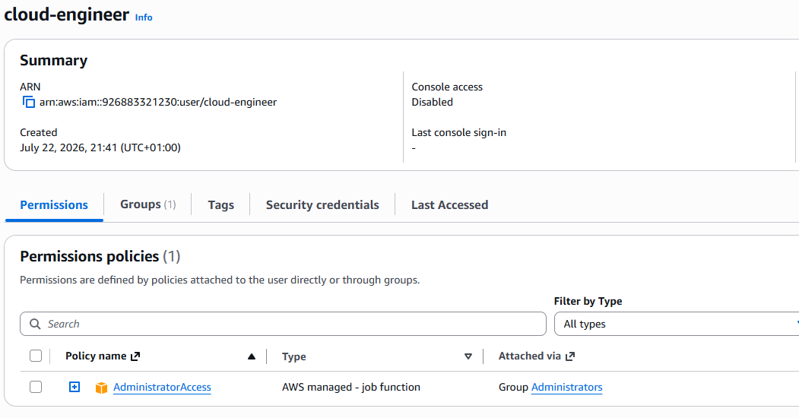
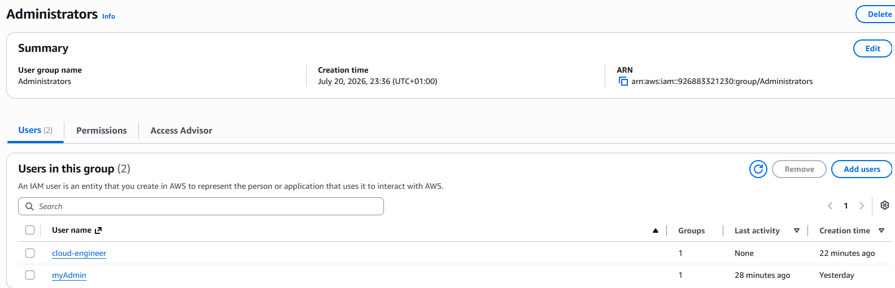
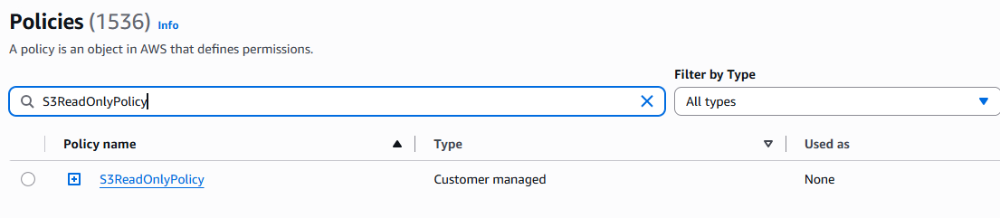
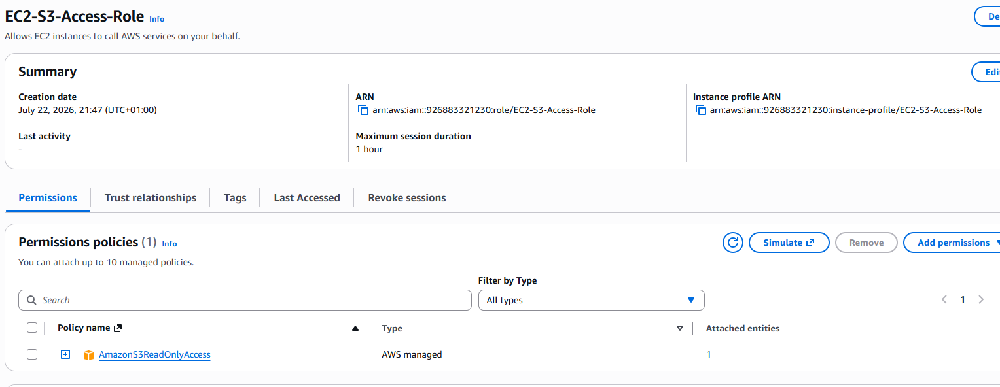

# Day 2 Notes - IAM

## What I Learned
- IAM controls identity and access in AWS.
- Users represent people or applications.
- Groups organize users and attach policies.
- Policies define permissions.
- Roles provide temporary access for AWS services.

## What I Created
- IAM Group: Admins
- IAM User: cloud-engineer
- Custom Policy: S3ReadOnlyPolicy
- IAM Role: EC2-S3-Access-Role

## IAM User

## IAM Group

## IAM Policy

## IAM Role

